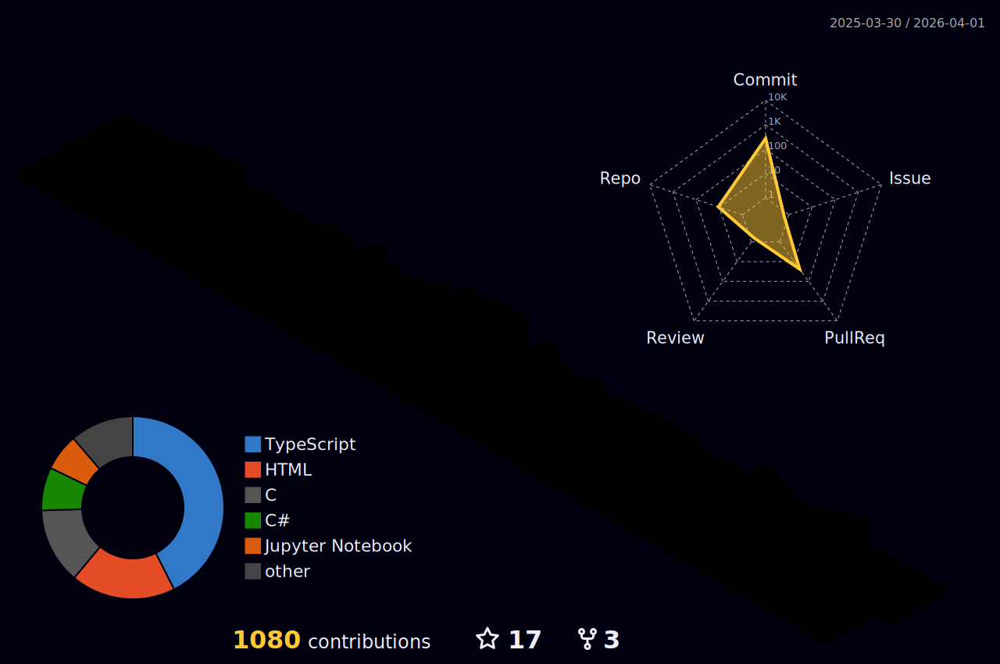

<div align="center">

# Hi there, I'm Hadi! 👋

[](https://git.io/typing-svg)

[](https://github.com/HadiHz88)
[](https://github.com/HadiHz88)

</div>

---

## 🚀 About Me

I'm a **Full Stack Software Engineer** with expertise in building scalable cloud-native applications and modern web solutions. Currently pursuing my **Master's in Computer Science** at Lebanese University while working as a **Computer Lab Assistant** teaching Data Structures & Algorithms.

> *Passionate about solving complex technical challenges and mentoring fellow developers* 🎯

## 📫 Connect with Me

<div align="center">

[](https://www.youtube.com/@HadiHz88) [](https://www.instagram.com/%5Fhadi%5Fhz/) [](https://www.linkedin.com/in/hadi-hijazi-27525b339/) [](https://www.facebook.com/profile.php?id=100005692666852) [](mailto:hijazih24@gmail.com)

</div>

## Before We Start

Feel free to check out my [website](https://www.hadihz.me) to get the full experience!

## 👨‍💻 What I'm Up To

```typescript
const hadi = {
    currentFocus: "Master's in Computer Science @ Lebanese University",
    role: "Looking for Full-Time Software Engineering Opportunities",
    recentAccomplishment: "Completed AWS Partner Training & Full Stack Internship",
    workingOn: ["Personal Portfolio & Course Platform", "Cloud-Native Applications"],
    learning: ["Advanced AWS Services", "Microservices Architecture", "System Design"],
    askMeAbout: ["React", "NestJS", "AWS", "System Architecture", "DSA"],
    funFact: "I'm a gamer to the core! 🎮"
};
```

## 💼 Experience

### ☁️ **ZeroAndOne** - *Full Stack Developer Intern*

**July 2025 - Sept 2025** | Cloud-native software & AWS consulting company

- Completed intensive 9-week full-stack development and cloud computing internship
- Successfully completed AWS Partner training (cloud architecture, networking, security, cost optimization)
- Engineered serverless applications using AWS Lambda, S3, DynamoDB, and Cognito
- Implemented CI/CD pipelines and infrastructure-as-code solutions

### 🎓 **Lebanese University** - *Computer Lab Assistant*

**Feb 2024 - Present** | Data Structures & Algorithms Course

- Facilitate weekly lab sessions for 30+ students on fundamental and advanced DSA concepts
- Provide technical mentorship through code reviews and debugging sessions
- Help students develop strong problem-solving skills and write efficient code

## 🎓 Education

**Master's in Computer Science** | Lebanese University | *Oct 2025 - Present*

**Bachelor's in Computer Science** | Lebanese University | *Oct 2021 - June 2025*

## 🛠️ Tech Stack

### Languages

       

### Frontend

   

### Backend

   

### Databases

    

### Cloud & DevOps

    

## 📚 Featured Projects

<table>
<tr>
<td width="50%">

### 🎯 **Dynamic Data Entry & Template-Based Form System**

[](#) [](#) [](#)

**Key Features:**

- 🔧 Flexible data entry system for multiple document types
- 🎨 Dynamic backend with customizable form templates
- 🔐 Secure admin dashboard with RBAC
- ⚡ Real-time form validation

</td>
<td width="50%">

### 🌐 **Bikhedemtak - Local Service Network**

[](#) [](#) [](#)

**Key Features:**

- 📱 Cross-platform web and mobile applications
- 👥 User-service provider connection system
- 🔍 Location-based service discovery
- 💬 Real-time messaging and requests

</td>
</tr>
<tr>
<td width="50%">

### 📊 **DonationsManager - Offline Tracking System**

[](#) [](#)

**Key Features:**

- 💾 Zero-setup offline deployment
- 📦 Portable with full PHP runtime
- 📈 Comprehensive donation analytics
- 🎯 Built for non-technical clients

</td>
<td width="50%">

### 🚀 **CloudQ- GenAI Powered ChatBot and LMS**

[](#) [](#) [](#) [](#)

**Key Features:**

- 🏗️ Modern NestJS architecture
- 🗄️ Prisma ORM integration
- 🔄 RESTful API design
- 📝 Comprehensive documentation
- 🤖 GenAI chatbot for learning assistance
- 📚 Advanced React State Management Patterns

</td>
</tr>
</table>

## 📊 GitHub Statistics

<div align="center">


</div>

<div align="center">




</div>

## 🌍 Languages

- 🇱🇧 **Arabic** - Native
- 🇺🇸 **English** - Fluent
- 🇫🇷 **French** - Fluent
- 🇩🇪 **German** - Intermediate

## 🎯 2025 Goals

- ✅ ~~Complete AWS certification and cloud development specialization~~
- 🚀 ~~Build comprehensive portfolio showcasing cloud-native applications~~
- 📚 ~~Master advanced React patterns and TypeScript~~
- 💻 Contribute to 5+ open source projects
- 🎯 Launch my own SaaS application
- 🎓 Excel in Master's program

---

<div align="center">

### 💬 Let's Connect and Build Something Amazing Together! 🚀

[](mailto:hijazih24@gmail.com)
[](https://www.linkedin.com/in/hadi-hijazi-27525b339/)
[](https://github.com/HadiHz88)

<sub>⭐️ From [HadiHz88](https://github.com/HadiHz88) with ❤️</sub>

</div>


