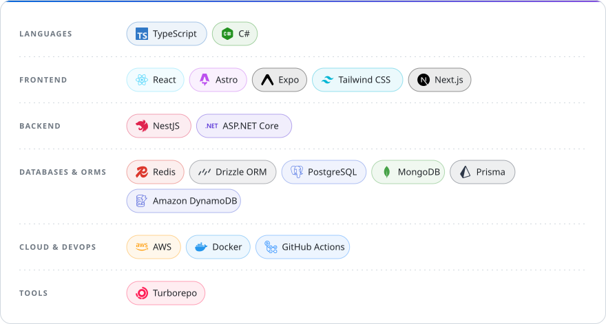
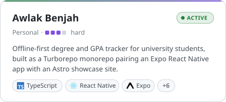
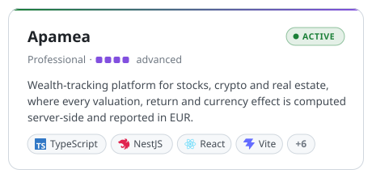
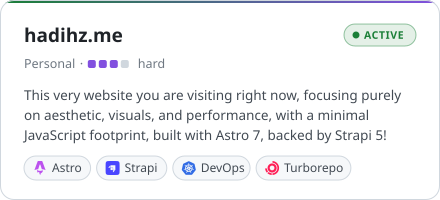
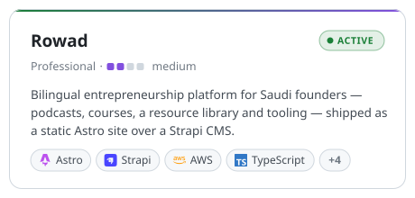
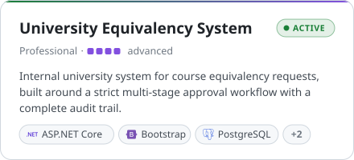
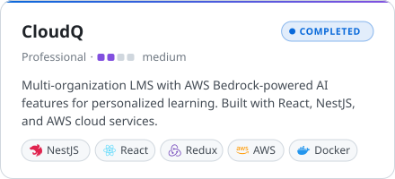
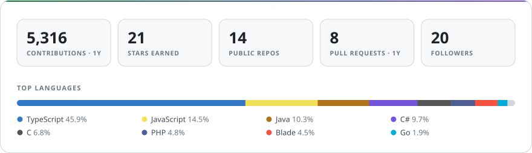
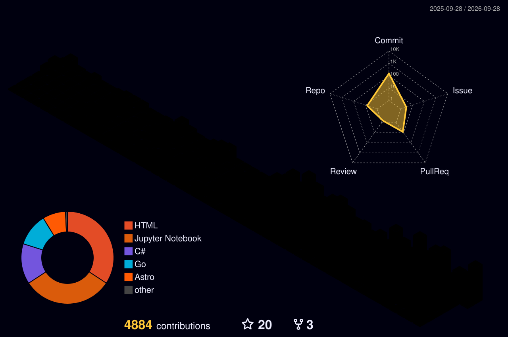

<div align="center">

# Hi there, I'm Hadi! 👋

<!-- TYPING:START -->
<picture><source media="(prefers-color-scheme: dark)" srcset="assets/generated/profile/typing-dark.svg"></picture>
<!-- TYPING:END -->

[](https://github.com/HadiHz88)
[](https://github.com/HadiHz88)

</div>

---

## 🚀 About Me

<!-- ABOUT:START -->
**Passionate full-stack developer** with ~2 years of experience in building *dynamic web applications*. Skilled in **JavaScript**, **TypeScript**, **React**, **Node.js**, and *database management*. Committed to writing **clean, efficient code** and continuously learning *new technologies*.
<!-- ABOUT:END -->

## 📫 Connect with Me

<!-- SOCIALS:START -->
<p align="center">
<a href="https://github.com/HadiHz88"><picture><source media="(prefers-color-scheme: dark)" srcset="assets/generated/profile/github-dark.svg"></picture></a>
<a href="https://www.linkedin.com/in/hadi-hijazi-27525b339/"><picture><source media="(prefers-color-scheme: dark)" srcset="assets/generated/profile/linkedin-dark.svg"></picture></a>
<a href="https://youtube.com/@hadihz88"><picture><source media="(prefers-color-scheme: dark)" srcset="assets/generated/profile/youtube-dark.svg"></picture></a>
<br>
<a href="https://www.instagram.com/hadi.hz.88/"><picture><source media="(prefers-color-scheme: dark)" srcset="assets/generated/profile/instagram-dark.svg"></picture></a>
<a href="mailto:hijazih24@gmail.com"><picture><source media="(prefers-color-scheme: dark)" srcset="assets/generated/profile/email-dark.svg"></picture></a>
</p>
<!-- SOCIALS:END -->

## Before We Start

Feel free to check out my [website](https://www.hadihz.me) to get the full experience!

## 👨‍💻 What am I up to?

<!-- EXPERIENCE:START -->
- 💼 **Junior Software Engineer** @ **Poyesis** · <sub>Full-time · since Jun 2026 · Beirut, Lebanon</sub>
<!-- EXPERIENCE:END -->

```typescript
const hadi = {
    workingOn: ["Student companion mobile app (Expo + React Native)", "Cloud-Native Applications"],
    learning: ["AI & Data Engineering", "DevOps practices", "Microservices Architecture"],
    askMeAbout: ["React", "Next.js", "NestJS", "AWS", "Astro", "System Architecture", "DSA"],
    funFact: "I'm a gamer to the core! 🎮"
};
```

## 🎓 Education

<!-- EDUCATION:START -->
- 🎓 **Master 2 — AI & Data Engineering** · [Lebanese University — Faculty of Science](https://ul.edu.lb) · <sub>Sep 2026 – Present · In progress</sub>
- 🎓 **Master in Computer Science** · [Lebanese University — Faculty of Science](https://ul.edu.lb) · <sub>Sep 2025 – Jun 2026</sub>
- 🎓 **Bachelor in Computer Science** · [Lebanese University — Faculty of Science](https://ul.edu.lb) · <sub>Sep 2021 – Jun 2025</sub>
<!-- EDUCATION:END -->

## 🛠️ Tech Stack

<!-- SKILLS:START -->
<p align="center">
<a href="https://hadihz.me/tags"><picture><source media="(prefers-color-scheme: dark)" srcset="assets/generated/skills/skills-dark.svg"></picture></a>
</p>
<!-- SKILLS:END -->

## 📚 Featured Projects

<!-- PROJECTS:START -->
<p align="center">
<a href="https://hadihz.me/projects/awlak-benjah"><picture><source media="(prefers-color-scheme: dark)" srcset="assets/generated/projects/awlak-benjah-dark.svg"></picture></a> <a href="https://hadihz.me/projects/apamea"><picture><source media="(prefers-color-scheme: dark)" srcset="assets/generated/projects/apamea-dark.svg"></picture></a>
<a href="https://hadihz.me/projects/hadihz-me"><picture><source media="(prefers-color-scheme: dark)" srcset="assets/generated/projects/hadihz-me-dark.svg"></picture></a> <a href="https://hadihz.me/projects/rowad"><picture><source media="(prefers-color-scheme: dark)" srcset="assets/generated/projects/rowad-dark.svg"></picture></a>
<a href="https://hadihz.me/projects/university-equivalency-system"><picture><source media="(prefers-color-scheme: dark)" srcset="assets/generated/projects/university-equivalency-system-dark.svg"></picture></a> <a href="https://hadihz.me/projects/cloudq"><picture><source media="(prefers-color-scheme: dark)" srcset="assets/generated/projects/cloudq-dark.svg"></picture></a>
</p>
<!-- PROJECTS:END -->

## 📊 GitHub Statistics

<!-- STATS:START -->
<p align="center">
<a href="https://github.com/HadiHz88?tab=repositories"><picture><source media="(prefers-color-scheme: dark)" srcset="assets/generated/stats/stats-dark.svg"></picture></a>
</p>
<!-- STATS:END -->

<div align="center">

<picture><source media="(prefers-color-scheme: dark)" srcset="assets/generated/snake/snake-dark.svg"></picture>



</div>

## 🌍 Languages

- 🇱🇧 **Arabic** - Native
- 🇺🇸 **English** - Fluent
- 🇫🇷 **French** - Fluent
- 🇩🇪 **German** - Intermediate

<!-- ## 🎯 2025 Goals

- ✅ ~~Complete AWS certification and cloud development specialization~~
- 🚀 ~~Build comprehensive portfolio showcasing cloud-native applications~~
- 📚 ~~Master advanced React patterns and TypeScript~~
- 💻 Contribute to 5+ open source projects
- 🎯 Launch my own Mobile application
- 🎓 Excel in Master's program -->

---

<div align="center">

### 💬 Let's Connect and Build Something Amazing Together! 🚀

<!-- CONTACT:START -->
<p align="center">
<a href="mailto:hijazih24@gmail.com"><picture><source media="(prefers-color-scheme: dark)" srcset="assets/generated/profile/email-dark.svg"></picture></a>
<a href="https://www.linkedin.com/in/hadi-hijazi-27525b339/"><picture><source media="(prefers-color-scheme: dark)" srcset="assets/generated/profile/linkedin-dark.svg"></picture></a>
<a href="https://github.com/HadiHz88"><picture><source media="(prefers-color-scheme: dark)" srcset="assets/generated/profile/github-dark.svg"></picture></a>
</p>
<!-- CONTACT:END -->

<sub>⭐️ From [HadiHz88](https://github.com/HadiHz88) with ❤️</sub>

</div>


